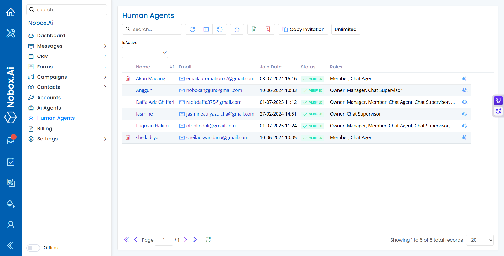

# <i class="fa-regular fa-users"></i> Human Agents

Human Agents di NoBox.Ai adalah pusat kontrol untuk mengelola seluruh pengguna manusia yang memiliki akses ke platform Anda. Fitur ini memungkinkan Anda untuk mengundang anggota tim, mengatur peran (roles), dan mengontrol hak akses mereka. Jika AI Agents adalah robot virtual, maka Human Agents adalah tim Anda di dunia nyata—seperti staf customer service, manajer, dan administrator—yang bertugas mengoperasikan, mengawasi, dan mengelola interaksi pelanggan.

<figure><figcaption></figcaption></figure>

Pada tampilan tersebut, Anda dapat melihat daftar seluruh agen beserta detailnya. Berikut adalah penjelasan untuk setiap kolom utama:

<table data-header-hidden><thead><tr><th width="150">Kolom</th><th>Fungsi</th></tr></thead><tbody><tr><td><strong>Name & Email</strong></td><td>Identitas unik setiap agen. Nama digunakan untuk identifikasi internal, sementara email digunakan untuk login dan notifikasi.</td></tr><tr><td><strong>Join Date</strong></td><td>Tanggal dan waktu kapan agen tersebut pertama kali bergabung atau mendaftar ke platform.</td></tr><tr><td><strong>Status</strong></td><td>Menunjukkan status verifikasi akun agen. Status <strong><code>VERIFIED</code></strong> berarti agen telah berhasil mengonfirmasi emailnya dan akunnya aktif sepenuhnya.</td></tr><tr><td><strong>Roles</strong></td><td>Peran atau jabatan yang menentukan tingkat hak akses agen di dalam sistem. Contohnya: <code>Owner</code>, <code>Manager</code>, <code>Chat Agent</code>. Peran ini sangat penting untuk membatasi fitur yang bisa diakses oleh setiap anggota tim.</td></tr></tbody></table>

## **Mengundang Agen Baru**

Penambahan Human Agents dilakukan melalui sistem undangan untuk menjamin keamanan. Untuk mengundang agen baru, silahkan klik tombol ➔**\[Copy Invitation]**.

Tindakan ini akan menyalin sebuah tautan undangan unik. Kirimkan tautan ini kepada calon anggota tim. Setelah mereka mendaftar melalui tautan tersebut, akun mereka akan otomatis ditambahkan ke dalam daftar Human Agents dengan status **\[VERIFIED]**.

Label **\[Unlimited]** di sebelahnya menandakan bahwa Anda dapat mengundang agen sebanyak yang Anda butuhkan tanpa batasan kuota.

## Edit dan Hapus Data Human Agents

Untuk mengedit suatu data Human Agent, silahkan pilih terlebih dahulu data mana yang akan diedit (misalnya, dengan mengklik nama agen). Editlah data seperti peran (roles) dan klik **\[Simpan]** untuk menyimpan perubahan tersebut. Untuk menghapus suatu data Human Agent adalah dengan pilih data Human Agent yang akan dihapus, kemudian klik ikon **Hapus (tong sampah)**, maka akan tampil dialog konfirmasi apakah Anda ingin menghapus data tersebut. Jika ya, klik **\[Ya]** jika tidak maka klik **\[Tidak]**.

***

Jika ada masalah atau kesulitan terkait Nobox.Ai, silahkan hubungi kami melalui [Support Ticket](https://crm.nobox.ai/clients/tickets)